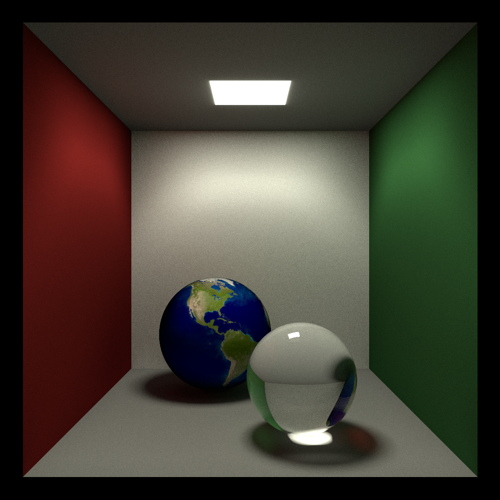
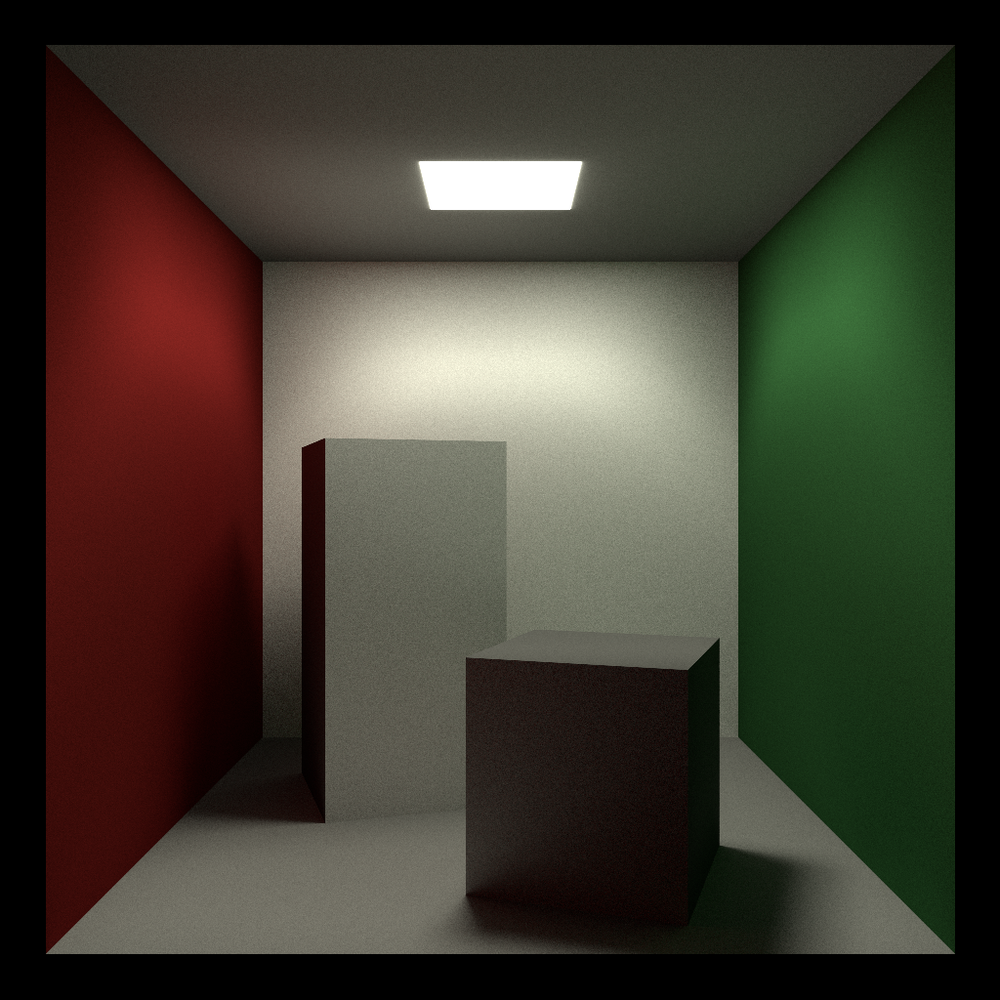

# Ray

Tiny CPU raytracer made in C11 for educational purposes

## Structure 

Shippable version consists of several files.
ray.exe is a command-line program that performs raytracing and saves it to dest file
editor.exe is a graphics application that provides user-accesible way of setting up scenes 
for raytracer

## Compilation 

Compilation is similar on all platforms: run build scripts, it will compile and put everything in build directory.

ON WINDOWS:
run build.bat
ON MACOS:
run build.sh

On windows LLVM is used to produce binary, not MSVC. And since LLVM is aviable on all other platforms, program makes use of some of clang's language extensions that make programming much more saner. Current version of code cannot be compiled with MSVC.

Currently compilation in done in what is called 'Unity build' - it consists of only one translation unit. This approach is often said to be bad, but it makes compile times much faster and is easy to maintain in such small project.
If project grows much more complicated, it is possible to integrate some build system, like cmake and switch to incremental build

## Features

Currently ray tracer is quite simple.
It supports a few materials: lambertian, diffuse, dielectrics. Materials can have procedural texturing or image texturing.
Multiple objects in scene - some primitives, like plane, sphere, disk, as well as complex triangle meshes.
Currently work is done on building acceleration structures for triangle meshes

## Some screenshots

> Note that raytracer is still early in development, so screenshots are not of the best possible quality 

## Used sources:
* https://www.youtube.com/c/MollyRocket/ 
* https://raytracing.github.io
* https://www.scratchapixel.com/ (this is THE best resource that i found)
* https://learnopengl.com/ (concepts)
* https://github.com/mmp/pbrt-v3 (Physically Based Rendering: From Theory to Implementation - the book)